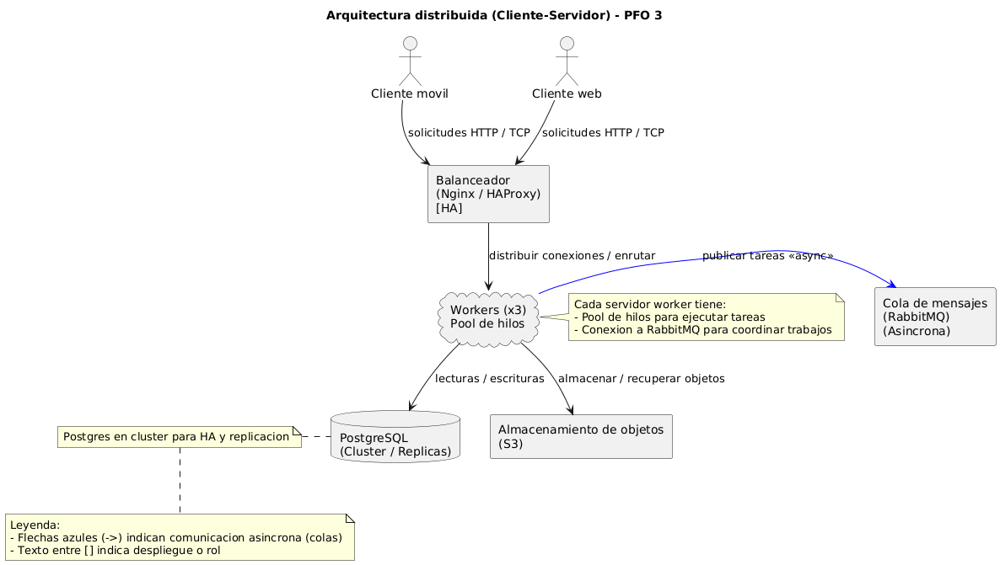

# Proyecto: cliente servidor

Pequeño proyecto educativo que arranca un servidor Flask (o similar) en segundo plano
y lanza un cliente interactivo en la terminal. El script principal de inicio es
`iniciar_todo.sh` dentro de esta carpeta.

## Qué hace `iniciar_todo.sh`
- Crea un virtualenv en `../PFO3_ENV` si no existe.
- Activa el virtualenv y (si fue creado) actualiza `pip`, `setuptools` y `wheel`.
- Instala las dependencias listadas en `requirements.txt`.
- Arranca `servidor.py` en segundo plano y, a continuación, ejecuta `cliente.py`.

## Requisitos
- Python 3 instalado y accesible en PATH (el script detecta `py`, `python3` o `python`).
- Git Bash o cualquier shell compatible con bash en Windows (recomendado para ejecutar `iniciar_todo.sh`).

## Cómo ejecutar (desde tu directorio actual)
Estas opciones preservan tu directorio de trabajo. No es necesario entrar en la carpeta `Proyecto`; el script se ejecuta desde aquí (hace `cd` internamente):

Usando `bash` (recomendado):
```bash
bash "./Proyecto/iniciar_todo.sh"
```


## Cómo detener el servidor

  - Si ejecutas el proyecto con `iniciar_todo.sh` y estás en el cliente en primer plano,
    puedes presionar Ctrl+C para detener cliente y servidor (el script maneja SIGINT).

## Notas sobre la actualización de pip
- El script actualiza `pip`, `setuptools` y `wheel` únicamente cuando crea el virtualenv nuevo. Esto evita el mensaje
  sobre nueva versión de pip y mejora la compatibilidad al instalar paquetes.
- Si prefieres que no se actualice automáticamente, edita `iniciar_todo.sh` y elimina o comente la línea:
  ```bash
  "${PY_BIN}" -m pip install --upgrade pip setuptools wheel
  ```

## Estructura del proyecto
```
Proyecto/
  cliente.py           # lanzador del cliente
  iniciar_todo.sh      # script de configuración y arranque
  requirements.txt     # dependencias
  servidor.py          # servidor principal
  cliente/             # código de cliente (menu, diagrama)
  servidor/            # helpers, db y worker
  Diagrama/            # archivos del diagrama (PlantUML)
```

## Solución de problemas rápidos
- "No se encontró Python 3 en PATH": instala Python o ejecuta el script desde un intérprete donde `python` esté disponible.
- Puertos ocupados: el servidor intenta puertos crecientes (5000, 5001...). Si todos fallan, revisa procesos locales.
- Fallos al instalar paquetes: revisa la salida de pip; comprueba la versión de Python y que wheels están disponibles.

## Contribuir / Cambios
- Para cambiar el comportamiento de creación del venv o la ubicación, modifica `iniciar_todo.sh`.
- Para agregar dependencias, edita `requirements.txt` y vuelve a crear el venv o instala en el venv existente.

## Autor
BARANDA CABRERA, Gustavo Daniel

Repositorio: [PFO-3-Redes](https://github.com/GustavoBaranda/PFO-3-Redes)

## Diagrama de arquitectura de la consigna Nro. 1




